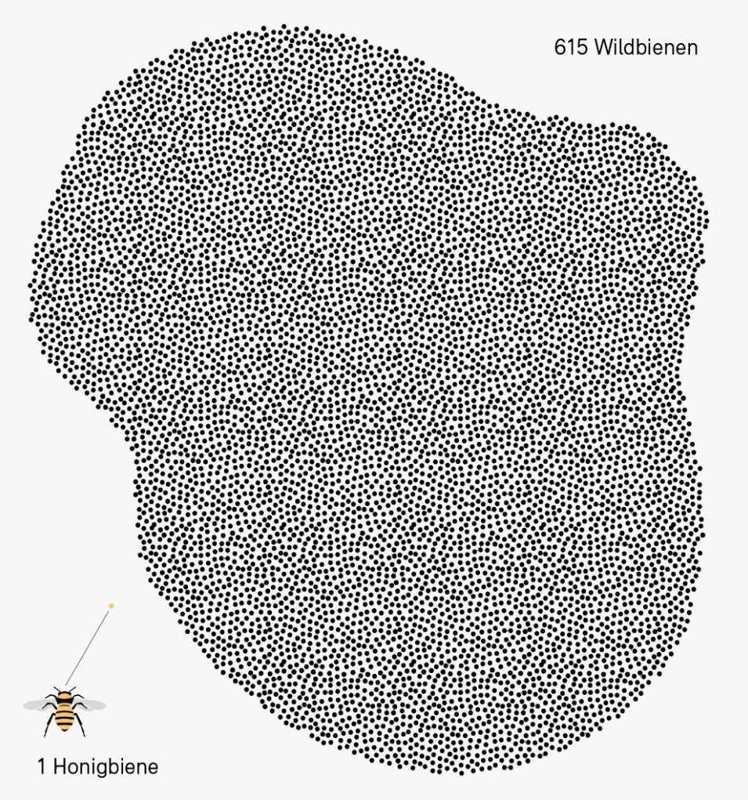

+++
title = "Bienensterben "
date = "2024-06-18"
draft = false
pinned = false
tags = ["Bienen", "Bienensterben", "Wildbienen", "Landwirtschaft", "Nachhaltigkeit", "Reportage"]
image = "samuelhaus-1.jpg"
description = "Überall wird von «Save the bees» gesprochen, doch müssen die Bienen wirklich gerettet werden?\n"
footnotes = "Quellen Bilder: \n\nNao Schenker - 17.06.2024\n\nhttps://www.bafu.admin.ch/bafu/de/home/themen/biodiversitaet/dossiers/wild-und-wertvoll.html - 19.05.2022\n\n\n\n\\*die Namen wurden von der Redaktion verändert"
+++
### Überall wird von «Save the Bees» gesprochen, doch müssen die Bienen wirklich gerettet werden?

<!--StartFragment-->

Der Himmel strahlt in einem hellen Blau und die Sonne wärmt die Luft. Das perfekte Wetter für die Bienen, die in Massen die Eingänge der Bienenstöcke passieren, um für das Volk Nahrung zu sammeln.\
«Heute ist das Wetter wirklich genial für die Bienen!», meint Herr Müller* zufrieden. Der 90-jährige Imker schaut stolz seinen kleinen Honigsammlerinnen bei der Nahrungssuche zu.\
Die Szene wirkt fast schon idyllisch.\
Herrn Müller und seinen kleinen Nutztieren scheint es wirklich gut zu gehen. Man könnte meinen, dass alles in bester Ordnung ist.

Trotzdem ist seit einiger Zeit der Begriff Bienensterben in aller Munde. Immer öfter hört man, was für schreckliche Folgen das Sterben der kleinen Tiere doch mit sich ziehe. Sogar Albert Einstein soll einst gesagt haben: 

> «Wenn die Bienen verschwinden, hat der Mensch nur noch vier Jahre zu leben.»

\
Es gibt bereits unzählige Medienbeiträge zu dem Thema. Viele davon wirken besorgniserregend. So zum Beispiel sieht man im berühmten Schweizer Dokumentarfilm «More than Honey», aus dem Jahr 2012, Horrorbilder aus China.\
Dort wurden 1958 auf den Befehl des ehemaligen Diktators Mao Zedong alle Spatzen ausgerottet, mit der Begründung, dass diese zu viel von der Ernte wegfressen würden. Dies hatte aber gleichzeitig zur Folge, dass es eine Überpopulation von Insektenschädlingen gab, aufgrund von fehlenden Fressfeinden. Um dem entgegenzuwirken, wurden Insektengifte eingesetzt, was aber zusammen mit den Folgen schwindender Natur dazu führte, dass Bienen in grossen Teilen Chinas ausstarben.\
Im Film wird gezeigt, wie die Bestäubung von Pflanzen vonstattengeht. Man sieht, wie Dutzende Arbeiter\*innen mit Pinseln Pollen auf die einzelnen Blüten streichen. Die Menschen sind aber deutlich weniger effizient als die nützlichen Insekten, denn es braucht rund 1500 Arbeitskräfte, um die Bestäubungsarbeit von einem Bienenvolk zu ersetzen. Ausserdem sind die Personalkosten zu hoch, weshalb es auch finanziell undenkbar wäre. Es ist klar, dass das keine nachhaltige alternative Bestäubungsart sein kann. Somit unterstreicht der Film die massgebliche Aussage Einsteins und führt den Zuschauer\*innen vor Augen, wie wichtig die geflügelten Nutztiere sind. Die Stadt Bern ist nicht so stark von dieser Problematik betroffen wie China. Dennoch kann man den Einfluss der Landwirtschaft in Bern nicht schönreden. Die verschiedenen Pestizide, die für bessere Ernten verwendet werden, können das Immunsystem der Insekten schädigen, teilweise so stark, dass ganze Schwärme sterben. Für die Bienen gibt es jedoch noch einige weitere Probleme.

<!--EndFragment-->

### Die Varroamilbe «Der Feind der Bienen»



Zur Kenntnis: Die Varroamilbe ist ein Insekt, welches seine Eier in die Waben der Bienen
pflanzt und sich auch an deren Kopf oder den Rücken heftet, wo sie dann Blut saugt und
somit Viren auf ihre Opfer übertragen kann. Diese Viren führen zu akuter Paralyse, 
Flügeldeformationen sowie Blutkrankheiten. Dies tötet ein Bienenvolk innerhalb von einem 
bis drei Jahren, wenn man nichts dagegen unternimmt. 



<!--StartFragment-->

Herr Müller übernahm 1984 ein Bienenhaus mit einigen Völkern. Zu dieser Zeit trat auch die berüchtigte, aus Asien stammende, Varroamilbe erstmals in der Schweiz auf.\
Herr Müller merkte zuerst selbst nicht viel davon, denn 1985 hatte er sein bestes Honigjahr. Pro Volk konnte er durchschnittlich 65 Kilogramm Honig ernten. In letzter Zeit sind es hingegen nur noch 20 Kilogramm pro Volk in einem Jahr.\
Doch auch seine Bienen blieben nicht lange unverschont. Anfangs wurden die Völker mit Giftstreifen behandelt. Das tat auch Herr Müller. Doch als er im Herbst 1985 so einen Streifen in die Bienenkästen legte, starben darauf die meisten seiner kleinen Arbeiterinnen. 

> «Als ich in diesem Jahr die Streifen wieder aus den Kästen genommen hatte, waren die meisten Bienen bereits tot.»

Das Gift eliminierte mit 95% Erfolgsquote die Varroa. Allerdings war es so stark, dass nicht nur die schädlichen Milben, sondern auch viele der Honigbienen daran eingingen. Zudem entwickelten die Schädlinge eine Immunität dagegen. Schnell wurde klar, dass das nicht die Lösung sein konnte.\
Seither benutzt man Ameisen- und Oxalsäure zur Behandlung. Komplett bekämpfen kann man die Varroa aber bis heute nicht. Die schädliche Milbe stellt daher auch aktuell noch das grösste Problem für Imker*innen dar. Jährlich müssen sie ihre Völker deshalb behandeln.

<!--EndFragment-->

<!--StartFragment-->

### Weitere Ursachen für das Bienensterben

\
Auch andere Faktoren, wie der Klimawandel und verschwindende Grünflächen beeinflussen die Gesundheit der Bienen stark. Zusätzlich gibt es seit letztem Jahr auch noch asiatische Hornissen im Kanton Bern, die sich mitunter von unseren Honigsammlerinnen ernähren.

«Die asiatischen Hornissen kreisen meistens um den Bienenstock und warten, bis ihre Beute aus dem Nest fliegt» berichtete uns Herr Weber*. «Das kann dazu führen, dass die Bienen teilweise nicht mehr aus ihren Stöcken herauskommen und dann zu wenig Nahrung haben.»

Für die Problematik mit den asiatischen Hornissen gibt es leider noch keine Lösung

<!--EndFragment-->

<!--StartFragment-->

### Gibt es das Bienensterben-Problem wirklich? 

Der Begriff Bienensterben wird deshalb sehr oft benutzt, da tatsächlich sehr viele der kleinen Brummer sterben. Doch die Lage der Honigbienen sieht nicht so schlimm aus, wie in den Medien oft verkündet wird. Die Imker*innen sorgen dafür, dass ihre Völker möglichst gesund bleiben und immer mehr Völker entstehen können. Darum ist die Anzahl der Honigbienen seit 1961 sogar um circa 83 Prozent gestiegen.\
Man kann die Imker\*innen sehr gut mit Erziehungsberechtigten vergleichen. Sie müssen auf ihre Völker aufpassen, diese ernähren und noch vieles mehr. Wenn die Imker\*innen nicht Sorge für ihre Nutztiere tragen, dann fliegen diese von ihrem Zuhause weg.

### Stadtimkerei, ist das die Lösung?

Aufgrund der Save-the-Bees-Bewegung ist die Stadtimkerei sehr stark im Trend. Immer mehr Leute halten Bienenvölker in der Stadt, denn in der Stadt finden die Tiere sehr viel Nahrung. Herr Weber ist auch einer davon. Er selbst besitzt 15 Völker. Er erwähnte, dass das Wichtigste die Zeit sei, denn die Honigbienen bräuchten sehr viel Fürsorge. Manche Stadtimker*innen vernachlässigen leider diese Arbeit. Im schlimmsten Fall kann unverantwortliches Imkern in der Stadt sogar zu einer Varroamilben-Kontamination führen.\
Auch wenn in der Stadtimkerei die Kontrolle der Gesundheit der Bienen wenig gefördert wird, gibt es sehr viele Vorteile: Obschon es irrational klingen mag, dass in Städten gute Bedingungen für die kleinen Brummer herrschen, ist das der Fall: viel Grünflächen, diverse Pflanzenarten, wenig Pestizide und keine Monokulturen. Das sind ideale Bedingungen für die kleinen Bestäuber. In den Städten leben deshalb auch viele Wildbienen. Die Idee ist sehr gut und einige Völker in der Stadt sind auf jeden Fall vorteilhaft, doch wenn es zu viele gibt, schadet es den Wildbienen.\
Wegen der stark ansteigenden Anzahl an Honigbienen in den Städten drohen die Wildbienen verdrängt zu werden.  Mit exzessiver Stadtimkerei hilft man deshalb den Falschen, denn die Honigbienen sind zwar sehr wichtig, jedoch nicht gefährdet.

Die meist solitär lebenden Wildbienen sind, wie der Name schon sagt, wild und haben deshalb keine Menschen, die aktiv zu ihnen schauen. Aus dem Grund sind diese deutlich stärker von Pestiziden, Klimawandel und von schwindenden Nahrungsquellen betroffen. Von letzterem sind sie am stärksten beeinflusst, da sie, ungleich der Honigbienen meist spezialisiert sind auf eine bestimmte Pflanze. Die Wildbienen haben also nicht eine grosse Auswahl an Nahrungsquellen, wie ihre domestizierten Verwandten. Deshalb ist es für diese besonders schlimm, wenn die Pflanze verschwindet, auf die sie spezialisiert sind. Sie haben kaum Alternativen und verhungern deshalb schneller.

<!--EndFragment-->

### Wildbienen



In der Schweiz gibt es rund 615 verschiedene Arten von Wildbienen, wovon 45% bedroht
sind oder bereits als ausgestorben gelten. Mit dem Schwinden dieser Tiere,
leidet auch die Biodiversität stark. Viele Blüten, welche oft von Honigbienen gemieden oder gar ganz unberührt gelassen werden, sind auf die Bestäubung von Wildbienen angewiesen. Die wilden Brummer sind meist auf eine Pflanze spezialisiert, die manchmal auch nur von dieser Art von Biene bestäubt werden kann. 
Ausserdem sind die Wildbienen meist effizientere Bestäuber als ihre honiggebenden Verwandten. So ist die 
gehörnte Mauerbiene bis zu 100-mal effektiver beim Bestäuben von Apfelblüten als die 
Honigbiene. Trotzdem gelten die domestizierten Honigsammlerinnen als wichtigste 
Bestäuber, da sie viele verschiedene Pflanzen befruchten können und in grossen Mengen
zu finden sind. Da diese aber nicht bedroht sind, ist es vor allem wichtig, dass man 
den Wildbienen mehr Aufmerksamkeit schenkt. Für eine reichhaltige Biodiversität braucht
es nämlich alle Bestäuberarten.



<!--StartFragment-->

### Der Blick in die Zukunft  

Die Prognose ist klar: Wenn man nichts unternimmt, wird es den Wildbienen immer schlechter gehen. Im Extremfall könnten die meisten Arten sogar aussterben. Die Save-the-Bees-Bewegung ist prinzipiell sehr gut, doch viele missinterpretieren sie, weil wir beim Stichwort Biene immer an Honigbienen denken. Dabei müssen diese gar nicht noch mehr gerettet werden. Diese Arbeit wird bereits von den Imker*innen erledigt.\
Die Bestäuber, die wirklich Hilfe und mehr Aufmerksamkeit benötigen, das sind die Wildbienen. Ihnen wird nicht genügend geholfen, weshalb fast die Hälfte dieser Arten vom Aussterben bedroht ist. Wir müssen etwas unternehmen, denn ohne sie würde die Biodiversität um einiges sinken und es käme zu ganzen Kettenreaktionen in Ökosystemen, die das Aussterben vieler weiterer Tiere und Pflanzen zur Folge hätte. Einige Institutionen wie zum Beispiel das Institut für Bienengesundheit der Universität Bern stellen Nachforschungen an, um den bedrohten Tieren zu helfen. Doch man muss nicht Forscher*in sein um Hilfe anzubieten. Jede Person trägt auch ein kleines Stückchen Verantwortung für den Bestand der Wildbienen.

<!--EndFragment-->

<!--StartFragment-->

### Tipps um den Bienen zu helfen:



#### 1. Kaufen von Bioprodukten

Bei der Zucht von Bioprodukten werden keine chemisch-synthetische Pflanzenmittel 
eingesetzt. Diese schwächen das Immunsystem von Bienen und greifen sogar das 
Nervensystem an, was dazu führt, dass deren Orientierungsvermögen und Gedächtnis
geschwächt wird. Das macht sie auch gleichzeitig anfälliger für Krankheiten und
Parasiten. Die Pestizide sind deshalb sehr schädlich und sollten deshalb weniger,
bis gar nicht eingesetzt werden.

#### 2. Nahrungsquellen anbieten

Ideal wäre, wenn man den eigenen Garten in eine Wildwiese umwandeln würde,
auf der verschiedene Pflanzen und Blumen wachsen könnten. Es ist aber klar, dass das
oftmals nicht möglich ist. Es hilft aber auch schon, wenn man einige Pflanzen und
Blumen rausstellen kann, von denen sich die Bienen ernähren können.

#### 3. Keine Pestizide gebrauchen

Da Pestizide die Gesundheit von den nützlichen Bestäubern stark beeinflussen ist es
ratsam keine Pestizide zu gebrauchen. Wenn man selbst gärtnert, hat man volle
Kontrolle über den Einsatz von Pestiziden und sollte diesen auf alle Fälle vermeiden.

#### 4. Insektenhotels betreiben

Insektenhotels sind eine tolle Dekoration für Gärten und Balkone. Gleichzeitig tun sie
den Wildbienen sehr gut, da diesen so ein Schlafplatz und eine Paarungsstätte zur
Verfügung steht.
Und solche Schlaf- und Nistplätze sind wirklich einfach herzustellen, da man dafür
nur totes Holz mit gebohrten Löchern rausstellen muss.



<!--EndFragment-->

<!--StartFragment-->

Herr Müller und Herr Weber waren sich einig: 

> «Die Natur ist das Wichtigste für die Bienen, sowohl für Honig-, wie auch für Wildbienen.»

Pestizide, Monokulturen und das Verschwinden von Grünflächen schaden den nützlichen Bestäubern. Die kleinen Insekten sind aber in ihrer Funktion als Bestäuber auch einer der wichtigsten Bestandteile der Natur. Wenn sie aussterben würden, gäbe es ganze Kettenreaktionen in verschiedenen Ökosystemen, durch die auch viele andere Spezien verschwinden würden. Es wäre eine Katastrophe, würde das Eintreffen. Damit die Biodiversität bestehen bleiben kann, muss etwas unternommen werden, um besonders Wildbienen zu helfen, denn die werden zurzeit vernachlässigt.

<!--EndFragment-->