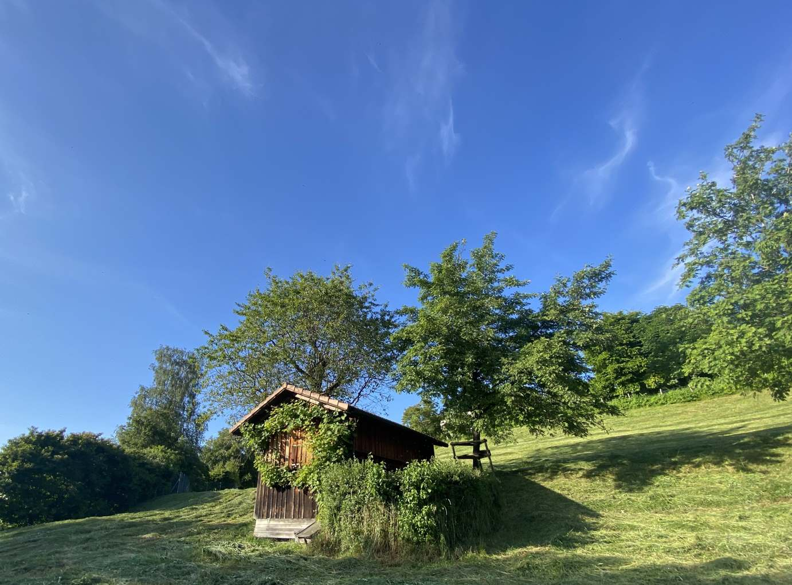

+++
title = "Reportage - Bienensterben"
date = "2024-06-18"
draft = false
pinned = false
tags = ["Bienen", "Bienensterben", "Landwirtschaft", "Reportage"]
image = "samuelhaus-1.jpg"
description = "Bienensterben\nÜberall wird von «Save the bees» gesprochen, doch müssen die Bienen wirklich gerettet werden?\n"
+++





<!--StartFragment-->

Der Himmel strahlte in einem hellen Blau und die Sonne wärmte die Luft. Das perfekte Wetter für die Bienen, die in Massen die Eingänge der Bienenstöcke passierten, um für das Volk Nahrung zu sammeln.\
«Heute ist das Wetter wirklich genial für die Bienen!», meinte Herr Müller* zufrieden. Der 90-jährige Imker schaute stolz seinen kleinen Honigsammlerinnen bei der Nahrungssuche zu.\
Die Szene wirkte fast schon idyllisch.\
Herrn Müller und seinen kleinen Nutztieren scheint es wirklich gut zu gehen. Man könnte meinen, dass alles in bester Ordnung ist.

Trotzdem ist seit einiger Zeit der Begriff Bienensterben in aller Munde. Immer öfter hört man, was für schreckliche Folgen das Sterben der kleinen Tiere doch mit sich ziehe. Sogar Albert Einstein soll einst gesagt haben: «Wenn die Bienen verschwinden, hat der Mensch nur noch vier Jahre zu leben.»\
Es gibt bereits unzählige Medienbeiträge zu dem Thema. Viele davon wirken besorgniserregend. So zum Beispiel sieht man im berühmten Schweizer Dokumentarfilm «More than Honey», aus dem Jahr 2012, Horrorbilder aus China.\
Dort wurden 1958 auf den Befehl des ehemaligen Diktators Mao Zedong alle Spatzen ausgerottet, mit der Begründung, dass diese zu viel von der Ernte wegfressen würden. Dies hatte aber gleichzeitig zur Folge, dass es eine Überpopulation von Insektenschädlingen gab, aufgrund von fehlenden Fressfeinden. Um dem entgegenzuwirken, wurden Insektengifte eingesetzt, was aber zusammen mit den Folgen schwindender Natur dazu führte, dass Bienen in grossen Teilen Chinas ausstarben.\
Im Film wird gezeigt, wie die Bestäubung von Pflanzen vonstattengeht. Man sieht, wie Dutzende Arbeiter*innen mit Pinseln Pollen auf die einzelnen Blüten streichen. Die Menschen sind aber deutlich weniger effizient als die nützlichen Insekten, denn es braucht rund 1500 Arbeitskräfte, um die Bestäubungsarbeit von einem Bienenvolk zu ersetzen. Ausserdem sind die Personalkosten zu hoch, weshalb es auch finanziell undenkbar wäre. Es ist klar, dass das keine nachhaltige alternative Bestäubungsart sein kann.\
Somit unterstreicht der Film die massgebliche Aussage Einsteins und führt den Zuschauer*innen vor Augen, wie wichtig die geflügelten Nutztiere sind. Die Stadt Bern ist nicht so stark von dieser Problematik betroffen wie China. Dennoch kann man den Einfluss der Landwirtschaft in Bern nicht schönreden. Die verschiedenen Pestizide, die für bessere Ernten verwendet werden, können das Immunsystem der Insekten schädigen, teilweise so stark, dass ganze Schwärme sterben. Für die Bienen gibt es jedoch noch einige weitere Probleme.

<!--EndFragment-->

```
Die Varroamilbe «Der Feind der Bienen» 
Zur Kenntnis: Die Varroamilbe ist ein Insekt, welches ihre Eier in die Waben der Bienen
pflanzt und sich auch auf den Kopf oder den Rücken heftet, wo sie dann Blut saugen und
somit Viren auf ihre Opfer übertragen können. Diese Viren führen zu akuter Paralyse, 
Flügeldeformationen sowie Blutkrankheiten. Dies tötet ein Bienenvolk innerhalb einem 
bis drei Jahren, wenn man nichts dagegen unternimmt. 
```

